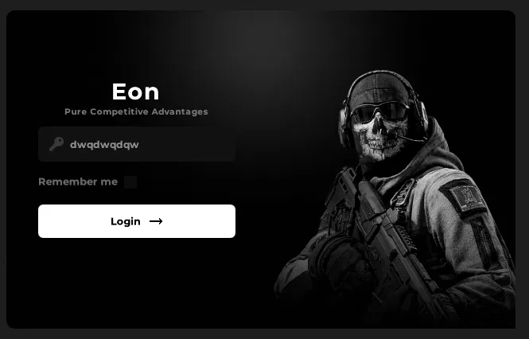

<div align="center">

# Eon
### Pure Competitive Advantages

> A clean, high-performance **Win32 + DirectX 11 + Dear ImGui** login UI framework — built for game tooling frontends.

</div>

---

## Overview

**Eon** is a standalone Windows GUI application shell designed as the authentication frontend for game modification tools. It renders a frameless, rounded, fully custom window using DirectX 11 and Dear ImGui — with no external GUI framework dependencies.

The codebase is intentionally minimal, clean, and easy to extend into a full-featured menu system.

---

## Features

- **Frameless borderless window** with DWM glass + custom rounded region
- **DirectX 11 rendering backend** — hardware-accelerated, low overhead
- **Custom Dear ImGui rendering pipeline** — no default ImGui chrome
- **Smooth animated UI** — hover/focus/press states with lerped transitions
- **Embedded assets** — fonts and images compiled directly into the binary (no loose files)
- **Drag-to-move** window with low-latency repaint during drag
- **License key input field** with placeholder, focus glow, and key icon
- **Remember me checkbox** with animated fill
- **Login button** with hover slide-in arrow icon and press feedback

---

## Tech Stack

| Layer | Technology |
|---|---|
| Language | C++17 |
| Windowing | Win32 API |
| Rendering | DirectX 11 (D3D11) |
| UI | Dear ImGui (custom renderer, no default window) |
| Transparency | DWM `DwmExtendFrameIntoClientArea` |
| Image loading | stb_image (header-only) |
| Font | Montserrat Bold (embedded via header) |
| Compiler | MSVC (Visual Studio 2022 / v143 toolset) |
| Target | Windows x64 |

---

## Project Structure

```
Eon/
├── src/
│   ├── main.cpp              # Entry point, Win32 window, D3D11 device, message loop
│   ├── gui.h                 # Namespace declarations, window config, font handles
│   ├── gui.cpp               # Full UI render logic (login panel, animations, textures)
│   ├── stb_image.h           # Single-header image decoder
│   ├── Fonts/
│   │   └── fonts.h           # Montserrat Bold embedded as byte array
│   ├── Images/
│   │   ├── glow.c / glow.h   # Background glow image (PNG → byte array)
│   │   ├── player.c / player.h  # Character image (PNG → byte array)
│   │   ├── key.c / key.h     # Key icon (PNG → byte array)
│   │   └── login.c / login.h # Arrow/login icon (PNG → byte array)
│   └── imgui/                # Dear ImGui source (Win32 + DX11 backends)
├── project.sln
├── project.vcxproj
├── .gitignore
└── README.md
```

---

## Building

### Requirements

- **Visual Studio 2022** (Community or higher)
- **Windows SDK 10.0**
- **DirectX 11** (included in the Windows SDK)

### Steps

1. Clone the repository:
   ```bash
   git clone https://github.com/YOUR_USERNAME/eon-loader.git
   ```

2. Open `project.sln` in Visual Studio 2022.

3. Select **Release | x64** configuration.

4. Build → **Build Solution** (`Ctrl+Shift+B`).

5. The binary will be at `x64/Release/project.exe`.

> **No additional dependencies required.** Everything is embedded or bundled.

---

## Architecture Notes

### Rendering Pipeline

```
WinMain
 └─ Win32 Message Loop
      └─ render_application_frame()
           ├─ ImGui_ImplDX11_NewFrame()
           ├─ ImGui_ImplWin32_NewFrame()
           ├─ ui::render()          ← custom draw list rendering
           └─ swap_chain->Present()
```

### UI System

All rendering goes through `ImDrawList` directly — no default ImGui widgets are used for visual elements. This gives full pixel-level control over the appearance.

Animation states use a simple `SmoothToward()` function (frame-rate-independent lerp) for hover, focus, and press transitions.

### Asset Pipeline

Images and fonts are pre-converted to C byte arrays and compiled into the binary:

```
image.png → bin2c / xxd → image.c (byte array) → compiled into .exe
```

This eliminates any runtime file I/O and makes the binary fully self-contained.

---

## Extending

To add new panels (e.g., a main menu after login), follow the same pattern as `DrawLoginPanel`:

1. Add a `DrawXxxPanel(ImDrawList* dl, ImVec2 wp)` function in `gui.cpp`
2. Call it conditionally from `ui::render()` based on an app state enum
3. Keep all state in `static` locals or a dedicated state struct

---

## License

This project is released for **educational and personal use only**.  
Do not use against games in violation of their Terms of Service.

---

<div align="center">
Made with C++ · DirectX 11 · Dear ImGui
</div>
